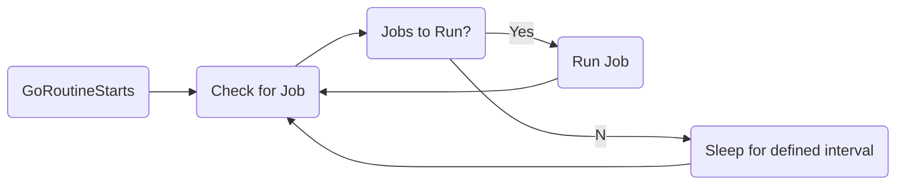

# Technical Action Scheduling

**User Story:** [EASI - 1603](https://jiraent.cms.gov/browse/EASI-1603)

Users would like to be notified 60 days before an LCID is expiring so that they can take actions to extend it. 

As the application grows, it would be beneficial to have standard functionality for scheduled action implementation.

- priority to simplicity, readability, and extensibility
<!-- 
optional -->

## Considered Alternatives

* Existing Job Queue Library
* AWS ECS Scheduled Task
* Bespoke Job / Publication Subscription Queue

## Decision Outcome

* Chosen Alternative: Bespoke Publication Subscription Queue
> * On server start, create a new Go Routine that runs on set intervals and runs jobs
> * Can decide how often to run the job

* Justification
> * Simplicity: 
>> * Writing our own publication queue will allow us to manage the job directly from the existing repository
>> * This avoids additional libraries and dependencies
> * Readability: 
>> * Because the code is in the same repo, it is easier to follow the logic.
> * Extensibility 
>> * We can easily add new events and extend for future uses

* Consequences
> * This will require boilerplate work that might be handled by a 3rd party library

* Follow Up Decisions
> * How customizable should this be?
> * Should we have an entry for each event? 
>> * It was noted that having one task specific to emailing all expiring LCIDS would be simplest, but it would also lack the granularity to retry actions upon failure.
> * Will the application require a more complex event driven behavior in the future? 
>> * If so, should we build a complete PUB / SUB system? Or should we focus solely on scheduling new jobs?

## Pros and Cons of the Alternatives <!-- optional -->

### Existing Job Queue Library
#### Suggested Libraries
* https://github.com/vmihailenco/taskq - Redis, SQS, IronMQ backend
* https://github.com/gocraft/work - Redis backend
* https://github.com/bgentry/que-go - Postgres backend

* `+` Leverage existing boilerplate code
* `+` Potentially avoid overlooking use cases / unknown gotchas
* `-` Added complexity an unnecessary dependencies
* `-` Additional methods of accessing database data
* `-` Not as lean of an option.

### AWS ECS Scheduled Tasks
[AWS Scheduled Tasks](https://docs.aws.amazon.com/AmazonECS/latest/developerguide/scheduled_tasks.html)
* `+` Flexible
* `+` Control the Compute resources used to execute the job
* `-` Added infrastructural complexity
### Bespoke Job / Publication Subscription Queue
* `+` Tailored specifically to applications needs
* `+` Doesn't require additional dependencies to be added. 
* `+` Extensible if further actions should be taken on an action
* `-` Will require extra boilerplate work that might be handled in a package

 
