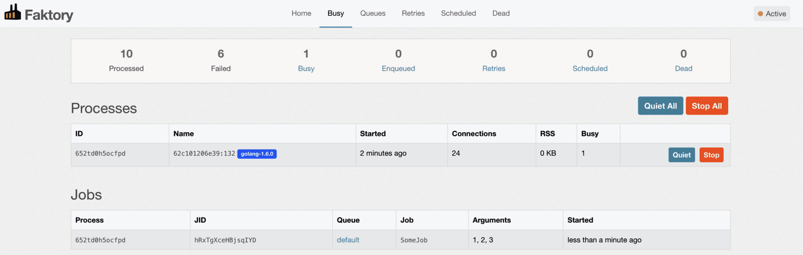

# Faktory

## What is Faktory
Faktory is a work server that processes jobs in the background. Jobs have a type and a set of arguments and are placed into queues for workers to fetch and execute.

## Setting Up and Running Server Locally
- Faktory server will spin up on app start. The GUI is located at `localhost:7420`. The password to get in locally is `faktorypassword` (there is no username).
- You can see your running Processes and Jobs on the `Busy` page.
  

## Registering, Creating, and Pushing Jobs
- Register a job and functions
  - In the `Work` function in  `pkg/worker/worker.go` register a job with a name and the function that job should call when it is processed.
    ```go
    mgr.Register("SomeJob", someFunc)
    ```
  - Next add the `someFunc` function to the bottom of the `pkg/worker/worker.go` file.
    ```go
    func someFunc(ctx context.Context, args ...interface{}) error {
      help := faktory_worker.HelperFor(ctx)
      log.Printf("Working on job %s\n", help.Jid())
      log.Printf("Context %v\n", ctx)
      log.Printf("Args %v\n", args)
      time.Sleep(10 * time.Second)
      return nil
    }
    ```
## Create and Push Job to Faktory
- Inside the function you want to create a job, create and push a job to Faktory
```go
  import (
    ...
    "github.com/cmsgov/mint-app/pkg/worker"
    faktory "github.com/contribsys/faktory/client"
    ...
  )

  // PlanCrTdlGet returns a plan_cr_tdl record in the database
  func PlanCrTdlGet(logger *zap.Logger, id uuid.UUID, store *storage.Store) (*models.PlanCrTdl, error) {
    result, err := store.PlanCrTdlGetByID(logger, id)

    client, err := worker.NewClient()
    job := faktory.NewJob("SomeJob", 1, 2, 3)
    err = client.Push(job)
    return result, err
  }
```
