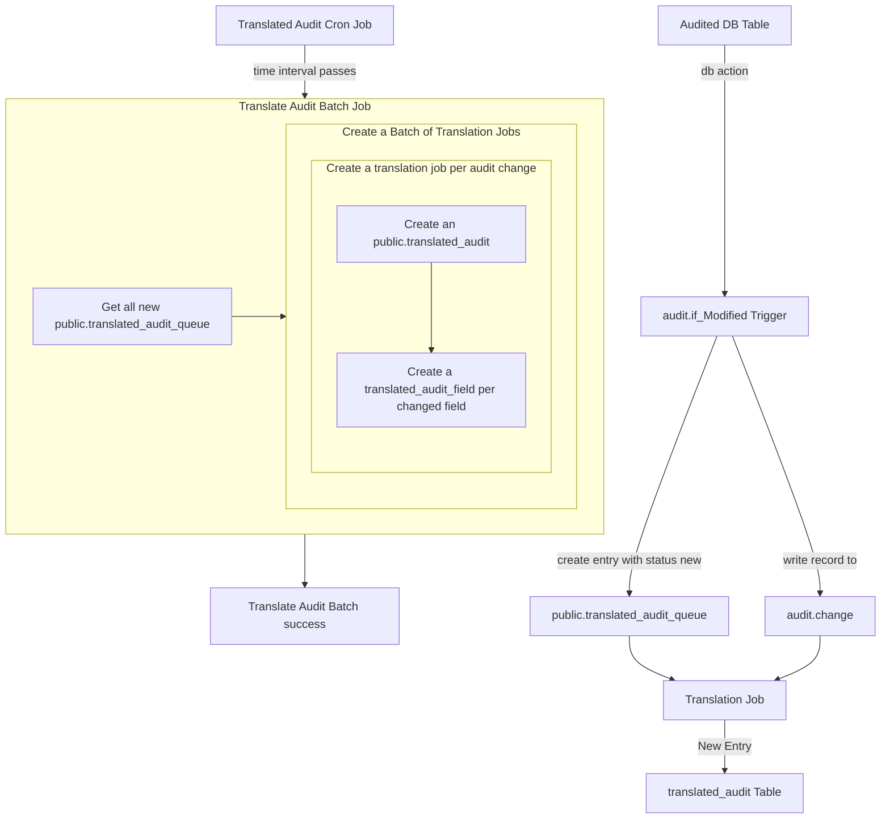

# Jobs

## Analyzed Audit

## Audit Translation

```mermaid
flowchart TD
    A["Translated Audit Cron Job"] -->|time interval passes| s1
    subgraph s1["Translate Audit Batch Job"]
    sub1[Get all new public.translated_audit_queue]-->s2
    subgraph s2["Create a Batch of Translation Jobs"]
    subgraph sSub1["Create a translation job per audit change"]
        translation1["Create an public.translated_audit"]
        translation1 --> translation2["Create a translated_audit_field per changed field"]
    end
    end
    end
    s1-->B["Translate Audit Batch success"]
    table1[Audited DB Table] -->| db action| trigger1["audit.if_Modified Trigger"]
    trigger1["audit.if_Modified Trigger"]
    trigger1 --> |write record to| table2["audit.change"]
    trigger1 --> |create entry with status new| table3["public.translated_audit_queue"]

    table3 --> translationJob["Translation Job"]
    table2--> translationJob
    translationJob -->|"New Entry"| table4["translated_audit Table"]
    


```
